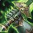

## 说明

自定义英雄对战地图打电脑系列视频。技能设计主要来源为评论区。

## 4. 奶骑

- 灵感来源：魔兽世界
- 视频链接：规划中

圣光术、黎明之光、道标、神圣复仇者

## 3. 武器战

- 灵感来源：魔兽世界
- 视频链接：规划中

怒火聚焦、致死打击、破战者、天神下凡

## 2. 邪DK

- 灵感来源：魔兽世界
- 视频链接：制作中

### 【自带被动】溃烂之伤

> 回蓝技能

死亡骑士的普通攻击会导致目标身上的一层溃烂之伤爆发，造成15点额外伤害并为死亡骑士恢复3点法力值。

### 死亡缠绕

> 主要能量消耗技能，叠debuff

释放邪恶的能量，对一个敌对目标造成点伤害，或者为一个友方亡灵目标恢复生命值。目标身上的每层溃烂之伤会为死亡缠绕增幅5%。并叠加溃烂之伤。普通攻击时，目标身上的每层溃烂之伤提供5%的几率立即冷却死亡缠绕并且不消耗法力值。

- 1级 - 恢复40%生命值，造成100点伤害，叠加3层溃烂之伤
- 2级 - 恢复60%生命值，造成200点伤害，叠加5层溃烂之伤
- 3级 - 恢复80%生命值，造成300点伤害，叠加7层溃烂之伤

### 亵渎

> AOE刮痧，快速叠debuff

亵渎死亡骑士指定的一片土地，每秒对所有敌人造成伤害并叠加一层溃烂之伤，持续10秒。当你站在自己的亵渎范围内时，你的普通攻击会击中目标附近的其他敌人。如果有任意敌人站在被亵渎的土地上，亵渎面积会扩大，伤害每秒都会提高10%。

- 1级 - 每秒造成5点伤害，击中2个敌人
- 2级 - 每秒造成10点伤害，击中4个敌人
- 3级 - 每秒造成15点伤害，击中6个敌人

### 天启

> 单体，大量回蓝，CC

引爆目标身上的所有溃烂之伤，造成一次攻击伤害，并召唤一只具有100点生命值、10点攻击力、麻痹毒液攻击的邪恶石像鬼进入战场，每层溃烂之伤可以为石像鬼提供额外属性。

- 1级 - 造成1.2倍的攻击伤害，每层溃烂之伤提供10点生命值和1点攻击力
- 2级 - 造成1.8倍的攻击伤害，每层溃烂之伤提供17点生命值和2点攻击力
- 3级 - 造成2.5倍的攻击伤害，每层溃烂之伤提供25点生命值和3点攻击力

### 【邪恶石像鬼】麻痹毒液

攻击使目标减速33%。

### 黑暗突变

学习此技能后，你的食尸鬼和石像鬼部队永久获得+10攻击力和+100生命值。

对一个食尸鬼施展，可以将其转化为一个拥有1800生命值的憎恶，并获得4个全新的强力技能。

### 【憎恶】【被动】横扫爪击

60%的顺劈斩。

### 【憎恶】蛮兽打击

一次野蛮的攻击，对目标造成150点伤害并使其昏迷2秒。

### 【憎恶】蹒跚冲锋

向敌人冲锋，打断其正在施放的法术并使其不能移动，持续6秒。

### 【憎恶】腐臭壁垒

发出固守咆哮，受到的所有伤害降低50%，持续10秒。

## 1. 血DK

- 灵感来源：魔兽世界
- 视频链接：https://www.bilibili.com/video/BV1xP411A7if/

### 死亡之握

运用笼罩万物的邪恶能量，将目标拉到死亡骑士面前来，并让其无法移动，并根据目标身上的瘟疫数量，延长持续时间。

- 1级 - 持续9秒，英雄3秒，每个瘟疫延长10%。
- 2级 - 持续12秒，英雄4秒，每个瘟疫延长20%。
- 3级 - 持续15秒，英雄5秒，每个瘟疫延长30%。

### 灵界打击

致命的攻击，对目标造成一次伤害，并根据目标身上的瘟疫数量，每有一个便为死亡骑士恢复他最大生命值百分比的效果，并且会将目标身上的所有瘟疫传染给附近所有敌人。

- 1级 - 造成80点伤害，每个瘟疫恢复8%最大生命值。
- 2级 - 造成120点伤害，每个瘟疫恢复12%最大生命值。
- 3级 - 造成160点伤害，每个瘟疫恢复16%最大生命值。

### 瘟疫打击【被动】

每次攻击都会依次给敌人造成鲜血瘟疫、冰霜瘟疫、邪恶瘟疫的效果。

鲜血瘟疫：目标受到攻击时，受到最大生命值百分比伤害。
冰霜瘟疫：一段时间后，受到一次冰霜伤害，目标移动速度越低，受到伤害越高。
邪恶瘟疫：受到持续的伤害，生命值越低，受到伤害越高，可叠加持续时间。

- 1级 - 鲜血瘟疫持续12秒，造成最大生命0.5%的伤害；冰霜瘟疫持续6秒，造成30伤害；邪恶瘟疫持续10秒，每2秒造成6伤害。
- 2级 - 鲜血瘟疫持续12秒，造成最大生命1%的伤害；冰霜瘟疫持续6秒，造成45伤害；邪恶瘟疫持续10秒，每2秒造成11伤害。
- 3级 - 鲜血瘟疫持续12秒，造成最大生命1.5%的伤害；冰霜瘟疫持续6秒，造成60伤害；邪恶瘟疫持续10秒，每2秒造成16伤害。

### 亡者大军

召唤一支食尸鬼军团为你作战。食尸鬼会在你附近的区域横冲直撞，攻击一切它们可以攻击的目标。

- 1级 - 召唤6个食尸鬼，每个具有660点生命值。
