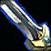
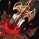

# 武器战

- **灵感来源**：魔兽世界
- **视频链接**：https://www.bilibili.com/video/BV1aK411m7d2/
- **WC3 基础单位**：`Obla`（剑圣）
- **地图**：Twisted Meadows
- **资源系统**：怒气（法力值百分比），战斗中自动生成

---

## 【自带主动】压制

敌人躲闪后可以使用，压制敌人，造成120%的攻击伤害。并使你的下一个致死打击造成的伤害提高20%。

- **FourCC**：`A016`
- **WC3 Base**：Channel (`Ncl`)
- **实现文件**：`LuaProject/Ability/Overpower.lua`

---

## 【自带被动】重伤

你的压制、致死打击、或者天神下凡状态下的普通攻击，会对敌人造成重伤效果，每2秒造成15%的攻击伤害，持续10秒。

- **FourCC**：`A017`
- **WC3 Base**：Passive (`Agyv`)
- **实现文件**：`LuaProject/Ability/DeepWounds.lua`

---

## 【被动】怒气生成

战斗中自动生成怒气（法力），每次受击和攻击都会产生怒气。

- **FourCC**：`A019`
- **WC3 Base**：Channel (`Ncl`)
- **实现文件**：`LuaProject/Ability/RageGenerator.lua`

---

## 冲锋

向一名敌人冲锋，造成20%的攻击伤害，使其定身。

| 等级 | 持续时间（普通） | 持续时间（英雄） |
|------|----------------|----------------|
| 1 | 10秒 | 2秒 |
| 2 | 20秒 | 5秒 |
| 3 | 30秒 | 10秒 |

- **FourCC**：`A018`
- **WC3 Base**：Channel (`Ncl`, order=sleep)
- **实现文件**：`LuaProject/Ability/Charge.lua`

---

## 致死打击

一次残忍的突袭，对目标造成攻击伤害，并使其受到的治疗效果降低70%，并造成一层重伤效果。产生20%的怒气。

| 等级 | 伤害倍率 | 治疗减益持续 |
|------|---------|-------------|
| 1 | 170% | 10秒 |
| 2 | 260% | 20秒 |
| 3 | 350% | 30秒 |

- **FourCC**：`A01A`
- **WC3 Base**：Channel (`Ncl`, order=slow)
- **实现文件**：`LuaProject/Ability/MortalStrike.lua`

---

## 判罪

让敌人为自己罪孽而遭受折磨，消耗剩余所有怒气造成伤害。只可对生命值高于80%或低于35%的敌人使用。如果未命中，返还20%的怒气。

| 等级 | 每1%怒气伤害 |
|------|-------------|
| 1 | 3 |
| 2 | 5 |
| 3 | 7 |

- **FourCC**：`A01B`
- **WC3 Base**：Channel (`Ncl`, order=cripple)
- **实现文件**：`LuaProject/Ability/Condemn.lua`

---

## 天神下凡

化作一股具有毁灭性力量的剑刃风暴，打击附近所有目标，每秒消耗15%的怒气，造成50%的攻击伤害并造成重伤效果，直到怒气耗尽。然后化身为巨人，使你造成的伤害提高20%，受到的伤害降低10%，普通攻击会附带重伤效果，持续时间等同于剑刃风暴的持续时间。

- **FourCC**：`A01C`
- **WC3 Base**：Channel (`Ncl`, order=whirlwind)
- **实现文件**：`LuaProject/Ability/BladeStorm.lua`

---

## 【废弃】灭战者

猛击地面并粉碎300码范围内所有敌人的护甲，造成伤害，并使你对其造成的伤害提高30%，持续10秒。

| 等级 | 伤害 | 伤害增幅 |
|------|------|---------|
| 1 | 75 | 15% |
| 2 | 125 | 30% |
| 3 | 175 | 45% |
